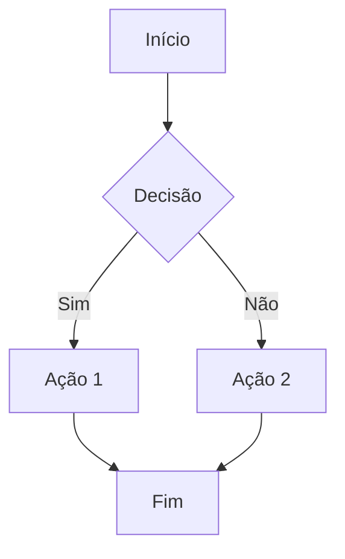

# Título Principal: Demonstração Avançada de Markdown

## Índice
1. [Formatação de Texto](#formatação-de-texto)
2. [Listas](#listas)
3. [Links e Referências](#links-e-referências)
4. [Código](#código)
5. [Tabelas](#tabelas)
6. [Gráficos e Diagramas](#gráficos-e-diagramas)
7. [Matemática](#matemática)
8. [Imagens e Multimídia](#imagens-e-multimídia)

## Formatação de Texto
*Texto em itálico*
**Texto em negrito**
***Texto em negrito e itálico***
~~Texto riscado~~
`Código inline`

## Listas

### Lista Ordenada
1. Primeiro item
2. Segundo item
3. Terceiro item
    1. Subitem 3.1
    2. Subitem 3.2

### Lista Não Ordenada
- Item principal
  - Subitem
    - Sub-subitem

### Lista de Tarefas
- [x] Tarefa concluída
- [ ] Tarefa pendente
- [ ] Outra tarefa pendente

## Links e Referências
[Link para Google](https://www.google.com)
[Link com título](https://www.example.com "Título do link")
[Referência de Link][link de exemplo]

[link de exemplo]: https://www.example.com

## Código
### Código em Linha
Use `console.log()` para imprimir.

### Bloco de Código com Destaque de Sintaxe
```python
def saudacao(nome):
    return f"Olá, {nome}!"

print(saudacao("Mundo"))
```

# exemplo de impressão de código kotlin
```
fun main(){
println("Olá mundo!")
}
```

## Tabelas
| Coluna 1 | Coluna 2 | Coluna 3 |
|----------|----------|----------|
| Linha 1, Col 1 | Linha 1, Col 2 | Linha 1, Col 3 |
| Linha 2, Col 1 | Linha 2, Col 2 | Linha 2, Col 3 |

## Gráficos e Diagramas


## Matemática
Equação inline: $E = mc^2$

Equação em bloco:
$$
\int_{-\infty}^{\infty} e^{-x^2} dx = \sqrt{\pi}
$$

## Imagens e Multimídia
### Imagem Local


### Imagem com Referência
![Texto Alternativo][imagem-ref]

[imagem-ref]: /caminho/para/imagem-referencia.png "Título da Imagem"

## Citações
> Esta é uma citação em bloco.
> 
> Pode conter múltiplas linhas.

## Notas de Rodapé
Aqui está uma nota de rodapé[^1].

[^1]: Esta é a explicação da nota de rodapé.

## Linha Horizontal
---

## HTML Inline
Alguns elementos HTML podem ser usados diretamente:
<details>
<summary>Clique para expandir</summary>
Conteúdo escondido aqui
<summary>Clique para expandir novamente</summary>
Conteúdo escondido aqui outra vez
</details>
